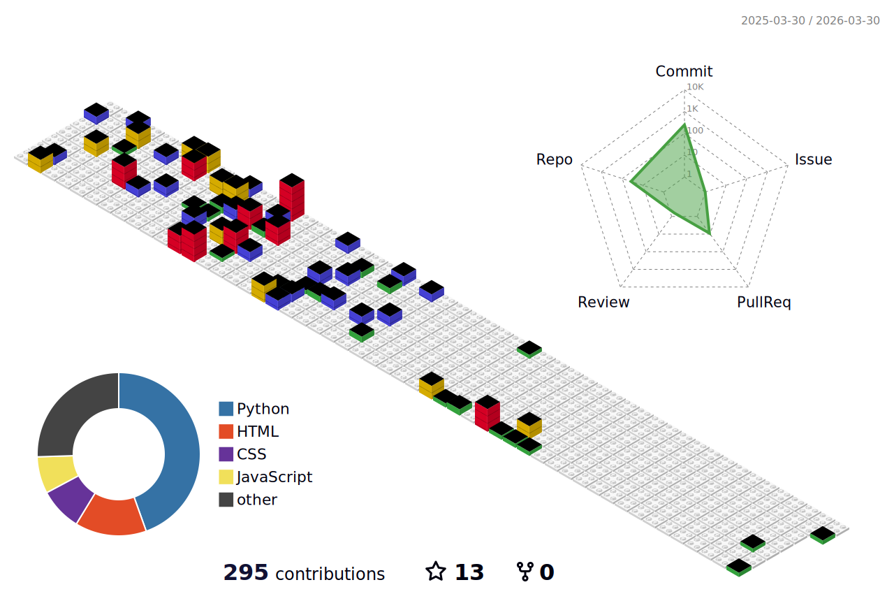

<h1 align="center">
  
</h1>

  🌍 São Paulo, Brazil • 🧠 17 Years old • 💻 Full-Stack Developer  

---

### 👨‍💻 About Me

- 🔭 Building practical projects that solve real problems and sharpen my skills  
- 🏢 Background: SENAI Swiss-Brazilian (JavaScript); currently in Systems Development at SEDUC-SP  
- 📚 Focused on Python, JavaScript, HTML/CSS, Node.js, React, Tailwind, Next.js, Docker, AWS  
- 🧠 I like learning by doing, keeping code clean and organized  
- 📖 Book lover (fantasy, classics, romance, thrillers) 

---

### 🧰 Tech Stack

  

---

### 📊 GitHub Stats

---

### 🚧 Personal Projects

  

    
    
  

  

    
    
  

---

  📖 "Books don't change the world, books change people, people change the world."

